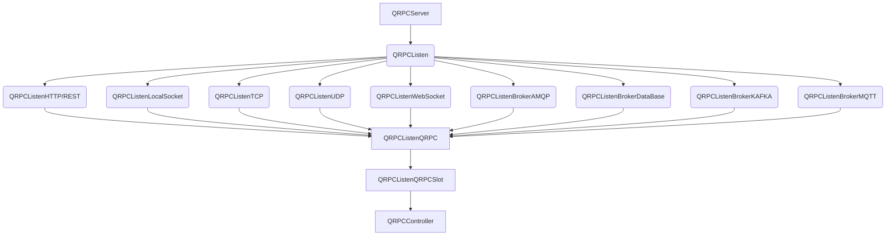

# QRpc

**Client/Server to working remote process call.**


## Working architecture



## CMake Build information


>```
>## initial CMake parameters 
>
>-GNinja
>-DCMAKE_BUILD_TYPE:STRING=Debug
>-DCMAKE_PROJECT_INCLUDE_BEFORE:PATH=%{IDE:ResourcePath}/package-manager/auto-setup.cmake
>-DQT_QMAKE_EXECUTABLE:STRING=%{Qt:qmakeExecutable}
>-DCMAKE_PREFIX_PATH:STRING=%{Qt:QT_INSTALL_PREFIX}
>-DCMAKE_C_COMPILER:STRING=%{Compiler:Executable:C}
>-DCMAKE_CXX_COMPILER:STRING=%{Compiler:Executable:Cxx}
>-DCMAKE_INSTALL_PREFIX=~/build/qcrosscache/install/Debug
>```

>```bash
> cd qrpc
> mkdir build;
> cd build;
> cmake ..
> make;
> make install;
>```

## QMake Build information

>```bash
> cd qrpc
> qmake qrpc.pro
> make;
> make install;
> ls -l;
>```

## Lib in you qmake application

>Check example in ../example/localcache

## Source in you application

>Check example in ../example/localcache


## Clients Connectors  

>```c++
> auto client=QCrossCache::clientForLocal(nullptr);
> auto client=QCrossCache::clientForMemcached(nullptr);
> auto client=QCrossCache::clientForMongoDb(nullptr);
> auto client=QCrossCache::clientForRedis(nullptr);
> 
>//main implementation
>#include <QCoreApplication>
>#include <QRpc/Server>
>
>int main(int argc, char *argv[])
>{
>    QCoreApplication a(argc, argv);
>
>    //server class
>    QRpc::QRPCServer server;
>
>    //set settings to run service
>    if(!server.setSettingsFileName(QStringLiteral(":/settings.json"))){
>        qWarning()<<"invalid settings";
>        return 0;
>    }
>
>    //start service
>    server.start();
>
>    //start eventloop application
>    return a.exec();
>}
>```

## Methods implementations

>Check example in QRpc/example/server-rest
>
>```c++
>#include <QRpc/Server>
>
>//!
>//! \brief The ControllerMethods class
>//!
>//! inhetihed of QRpc::QRPCController
>class ControllerMethods : public QRpc::QRPCController
>{
>    Q_OBJECT
>public:
>    //!
>    //! \brief ControllerMethods
>    //! \param parent
>    //!
>    //! necessary Q_INVOKABLE
>    Q_INVOKABLE explicit ControllerMethods(QObject *parent = nullptr);
>
>
>    //!
>    //! \brief authorization
>    //! \return
>    //!
>    //! authorization validations
>    //! check more authorization methods:
>    //!     canAuthorization
>    //!     beforeAuthorization
>    //!     afterAuthorization
>    //!
>    virtual bool authorization();
>
>    //!
>    //! \brief listObjects
>    //! \return
>    //!
>    //! method to return object list, necessary Q_INVOKABLE
>    //! check more Invoke methods:
>    //!     requestBeforeInvoke
>    //!     requestAfterInvoke
>    Q_INVOKABLE QVariant listObjects();
>
>};
>
>//auto register interface
>QRPC_CONTROLLER_AUTO_REGISTER(ControllerMethods)   
>```


## Example

>Check example in QRpc/example/server-rest
>```bash
> curl -i http://localhost:8888/listObjects?limit=1
> ```
>```bash
      >HTTP/1.1 200 (OK)
      >Vary: Accept-Encoding, Origin
      >Date: Sat Jan 15 18:50:02 2022
      >Content-Length: 59
      >Server: Undef
>```
>```json
>[{"index":1,"uuid":"ba01138f-f7b0-4874-a879-caa591ab9e55"}]
>```